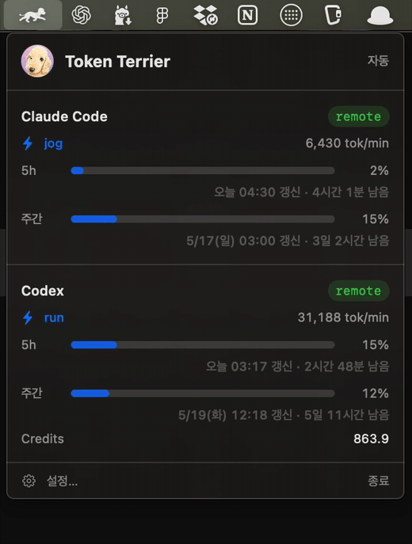

<p align="center">
  
</p>

<h1 align="center">Token Terrier</h1>

<p align="center">
  Monitor local and remote Claude Code / Codex token usage from your macOS menu
  bar, powered by Bapful the Bedlington Terrier.
</p>

<p align="center">
  <a href="https://github.com/codemoo/token-terrier/actions/workflows/ci.yml">
    
  </a>
</p>

Token Terrier is built around one idea: the token meter does not have to run on
the same Mac where you are looking at it.

Run the lightweight Go server wherever the real work happens, then view live
Claude/Codex usage from your menu bar over HTTP/SSE. That can be the same Mac,
another workstation, a remote Mac, or any machine that owns the credentials and
session logs. The app can also fall back to direct local reads when everything is
on one Mac.

<p align="center">
  
</p>

```text
Claude/Codex credentials + logs
          |
          v
server-go HTTP/SSE server  --->  Token Terrier menu bar app
   local or remote host              macOS viewer
```

## Why Token Terrier?

Most token monitors assume the viewer and the work are on the same machine.
Token Terrier separates collection from viewing: run `server-go` where Claude
Code or Codex is actually doing work, then watch live usage from your Mac menu
bar.

- Remote-first monitoring for agents running on another Mac, workstation, or
  server.
- One compact menu bar view for Claude Code and ChatGPT Codex.
- Live HTTP/SSE updates with local direct-read fallback for single-Mac setups.
- Small public surface: a SwiftUI menu bar app and a standalone Go server.
- A running Bedlington Terrier whose pace follows token burn.

## What It Does

- Shows Claude Code and ChatGPT Codex usage in a compact macOS menu bar app.
- Separates collection from viewing, so remote token activity can be monitored
  from another Mac.
- Streams updates over provider-scoped SSE endpoints.
- Reads Claude/Codex OAuth credentials, JSONL session logs, optional Hermes
  SQLite data, and optional codex-lb API aggregate usage.
- Uses bundled Bedlington Terrier assets for the app icon and menu bar animation.
- Supports Sparkle app updates through GitHub Releases.

## Repository Layout

```text
Sources/token-run-menubar/   macOS SwiftUI MenuBarExtra app
Sources/TokenUsageCore/      shared Swift parsing, state, OAuth, and local logic
server-go/                   standalone Go HTTP/SSE server
scripts/                     app packaging and release helpers
infra/sparkle-public-key.txt Sparkle public update key
```

Machine-specific deployment files, private hostnames, private keys, and local
tokens are intentionally not part of this repository.

## Install

Download the latest macOS app from
[GitHub Releases](https://github.com/codemoo/token-terrier/releases/latest).

For remote monitoring, build and run `server-go` on the machine that owns the
Claude/Codex credentials and logs, then point the app at that server's base URL.

Current releases are ad-hoc signed for personal/internal use, so macOS may ask
you to approve the first launch. Developer ID signing, notarization, and a
Homebrew cask are still future distribution work.

## Quick Start

Build and test everything:

```sh
swift build
swift test

cd server-go
go test ./...
go build ./cmd/daemon
```

Run the server on the machine that has the Claude/Codex credentials and logs:

```sh
cd server-go
go run ./cmd/daemon
```

Run the menu bar app during development:

```sh
swift run token-run-menubar
```

In the app settings, set the remote endpoint to the server base URL, for example:

```text
https://your-token-server.example.com
```

The app connects to `/claude/sse` and `/codex/sse` under that base URL.

## Server Defaults

`server-go` defaults to local files on the machine where it is running:

```text
HTTP bind:          127.0.0.1:18910
Bearer tokens:      ~/.config/token-usage/tokens.json
Claude credentials: ~/.claude/.credentials.json
Codex credentials:  ~/.codex/auth.json
Claude JSONL:       ~/.claude/projects/**/*.jsonl
Claude-swap JSONL:  ~/.claude-swap-backup/sessions/*/projects/**/*.jsonl
Codex JSONL:        ~/.codex/sessions/**/*.jsonl
Hermes SQLite:      ~/.hermes/state.db
codex-lb API:       http://127.0.0.1:2455/v1/usage
```

Useful environment variables:

```sh
TOKEN_USAGE_BIND=127.0.0.1
TOKEN_USAGE_PORT=18910
TOKEN_USAGE_CLAUDE_CRED=/path/to/.claude/.credentials.json
TOKEN_USAGE_CODEX_CRED=/path/to/.codex/auth.json
TOKEN_USAGE_CLAUDE_PROJECTS=/path/to/.claude/projects
TOKEN_USAGE_CLAUDE_SWAP_SESSIONS_ROOT=/path/to/.claude-swap-backup/sessions
TOKEN_USAGE_CODEX_SESSIONS=/path/to/.codex/sessions
TOKEN_USAGE_HERMES_DB=/path/to/.hermes/state.db
CODEX_LB_API_KEY=<codex-lb-api-key>
TOKEN_USAGE_CODEX_LB_URL=http://127.0.0.1:2455
TOKEN_USAGE_CODEX_LB_API_KEY=<codex-lb-api-key>
TOKEN_USAGE_DISABLE_JSONL=1
TOKEN_USAGE_DISABLE_CLAUDE_SWAP_SESSIONS=1
TOKEN_USAGE_DISABLE_HERMES=1
TOKEN_USAGE_DISABLE_CODEX_LB=1
```

## HTTP API

```text
GET /healthz
GET /version
GET /claude/snapshot
GET /claude/sse
GET /codex/snapshot
GET /codex/sse
```

`/claude/*` and `/codex/*` require provider-specific bearer tokens from
`~/.config/token-usage/tokens.json`, generated on first server run.

## Local And Remote Modes

Token Terrier supports four app-side connection modes:

- Auto: try loopback first, then remote.
- Remote server: use only the configured remote endpoint.
- Local server: use only `127.0.0.1:18910`.
- Local direct read: skip the server and read local credentials/logs in-process.

For remote monitoring, run `server-go` on the machine that owns the usage data
and expose only its base URL to the menu bar app. Keep endpoint-specific
deployment details outside the repository.

## Release

Package and publish a Sparkle-updatable app with GitHub Releases:

```sh
VERSION=x.y.z GITHUB_REPOSITORY=codemoo/token-terrier GITHUB_RELEASE=1 ./scripts/release.sh
```

The release script expects the Sparkle private key at
`infra/sparkle-private-key.backup`; that file must never be committed.

Current packaging is host-architecture and ad-hoc signed. Broader public
distribution still needs Developer ID signing and notarization.

## Notes

- The app icon is Bapful, a Bedlington Terrier.
- The menu bar animation uses bundled `bedl-*` frame images.
- Codex OAuth refresh parameters and endpoints are attributed to the CodexBar
  prior art.

## License

MIT
